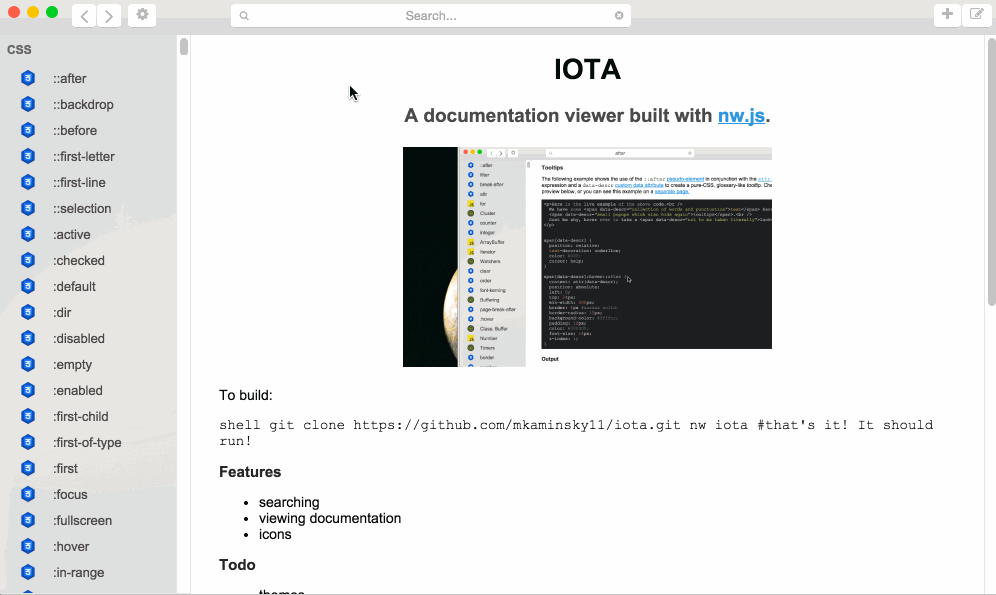

#IOTA

A documentation viewer built with [nw.js](http://nwjs.io/).


To build:
```shell
git clone https://github.com/mkaminsky11/iota.git
nw iota #that's it! It should run!
```

###Features
+ searching
+ viewing documentation
+ icons

###Todo
+ themes
+ keyboard shortcut (duh)

###Docsets Done
+ nw (node webkit)
+ node.js/io.js (full!)
+ javascript (full!)
  + es6
+ CSS (full!)

###Docsets Todo
+ Swift?
+ Markdown
+ HTML

###Serious Problems
Two words: memory usage. This whole thing takes up ~40MB. That's ridiculous.

###Contributing
####Useful Links
+ [Dash docsets](http://kapeli.com/docset_links) (on Mac, do `right click + show packaged contents`)
+ [Mozilla Developer Network](https://developer.mozilla.org/en-US/)

####Creating Docs
Go into `docs`, and you'll find a bunch of folders for each language (when this was last updated, just node.js). The name of the folder doesn't really matter, but you should add a nice icon named `icon.png` with a transparent background.

Inside the language folders, there are bunch of folders. Again, their names don't matter, but they should be logically organized.

Documentation is in markdown. The name of the documented item is an `<h2>`(`##` in markdown). **There should be NO OTHER ##'s**.
```markdown
##Documenting This

This is some documentation
'''javascript
//hello
'''
```
If you want, you can also create a `script.js` file in the language directories, which pull data from online sources. They sould work with Node.js/IO.js .
