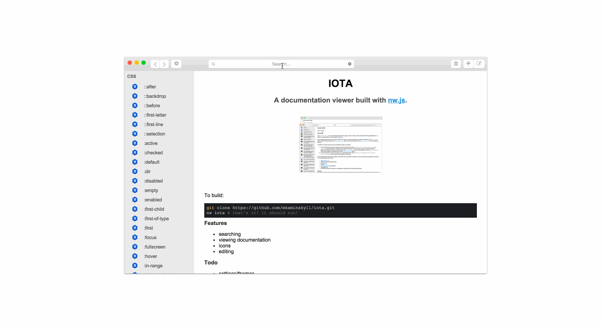

#IOTA

##A documentation viewer built with [nw.js](http://nwjs.io/).


### [download](Download release [here](https://github.com/mkaminsky11/iota/releases)

####Windows
To build from source, see "All".

####Linux
To build from source, see "All".

Download release [here](https://github.com/mkaminsky11/iota/releases)

```shell
tar -zxvf iota_linux_32.tar.gz
cd iota_linux_32
cp * /bin
#to use
iota
```

####Mac
To build from source, see "All".

Download release [here](https://github.com/mkaminsky11/iota/releases). Then unzip and use as a normal application.

####All

```shell
git clone https://github.com/mkaminsky11/iota.git
nw iota #that's it! It should run!
```

You can also [download](https://github.com/mkaminsky11/iota/releases) the app (currently for OSX and Linux only).

###Features
+ searching
+ viewing documentation
+ icons
+ editing
+ create new documentation
+ delete documentation
+ favorites

###Todo
+ settings/themes
+ keyboard shortcut
+ refresh on edit **DONE**
+ make sure editing is valid (only one `##` before updating) **DONE**
+ error messages
+ create own docsets
+ filter by favorites **DONE**
+ context menu **DONE?**
+ **BUILD FOR LINUX + WINDOWS**

###Docsets Done
+ nw (node webkit)
+ node.js/io.js (full!)
+ javascript (full!)
  + es6
+ CSS (full!)

###Docsets Todo
+ Swift?
+ Markdown
+ HTML
+ Python

###Serious Problems
This whole thing takes up ~60MB. Blame the huge number of `.md` files.

###Contributing
####Useful Links
+ [Dash docsets](http://kapeli.com/docset_links) (on Mac, do `right click + show packaged contents`)
+ [Mozilla Developer Network](https://developer.mozilla.org/en-US/)

####Creating Docs
Go into `docs`, and you'll find a bunch of folders for each language (when this was last updated, just node.js). The name of the folder doesn't really matter, but you should add a nice icon named `icon.png` with a transparent background.

Inside the language folders, there are bunch of folders. Again, their names don't matter, but they should be logically organized.

Documentation is in markdown. The name of the documented item is an `<h2>`(`##` in markdown). There should be NO OTHER `##`s besides the title.

###[License](LICENSE.md)
Available under the MIT License
